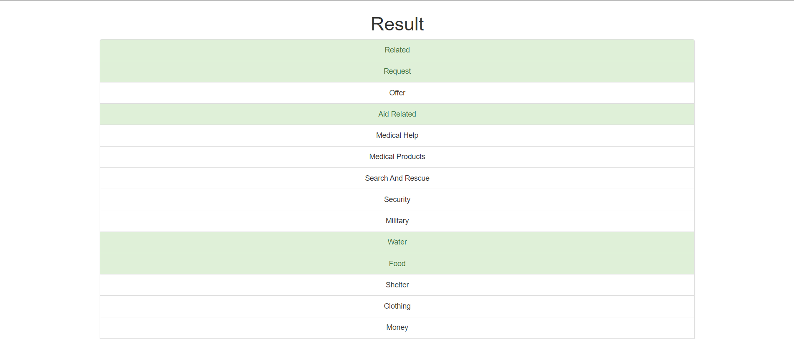

# Disaster Response Pipeline Project (Udacity - Data Science Nanodegree)

## Table of Contents
1. [Description](#description)
2. [Getting Started](#getting_started)
	1. [Dependencies](#dependencies)
	2. [Installation](#installation)
	3. [Executing Program](#execution)
3. [Additional Material](#material)
4. [Important Files](#importantfiles)
5. [Acknowledgement](#acknowledgement)
6. [Demo](#demo)


<a name="descripton"></a>
## Description

This repository contains the source code for Disaster Response Pipeline project. This Project is part of Data Science Nanodegree Program by [Udacity](https://www.udacity.com/course/data-scientist-nanodegree--nd025) in collaboration with [Figure Eight](https://www.figure-eight.com/). The dataset contains pre-labelled tweet and messages from real-life disaster events. The objective of this project is to build a Natural Language Processing (NLP) model and create a web app to categorize real disaster messages.

This project is divided in the following key sections:

1. Build an ETL pipeline to extract data from source, then clean the data, transform the data and save them in a SQLite DB;
2. Build a machine learning pipeline to train a model which can classify text messages to various categories;
3. Run a web app which can show model results for real messages.

<a name="getting_started"></a>
## Getting Started

<a name="dependencies"></a>
### Dependencies
* Python 3.8
* Natural Language Process Libraries: `NLTK`
* SQLlite Database Libraqries: `SQLalchemy`
* Machine Learning Libraries: `NumPy`, `Pandas`, `Scikit-Learn`
* Model Loading and Saving Library: `Pickle`
* Web App and Data Visualization: `Flask`, `Plotly`

<a name="installation"></a>
### Installation

To clone the git repository:
```
git clone https://github.com/hwdsda/Udacity-disaster-response-pipelines.git
```
<a name="execution"></a>
### Executing Program:

1. Run the following commands in the project's root directory to set up your database and model.

- To run ETL pipeline that cleans data and stores in database
```
python data/process_data.py data/disaster_messages.csv data/disaster_categories.csv data/DisasterResponse.db
```
- To run ML pipeline that trains and saves classifier
```
python models/train_classifier.py data/DisasterResponse.db models/classifier.pkl
```

2. Run the following command in the app's directory to run your web app.
    `python run.py`

3. Go to http://0.0.0.0:3001/. Alternatively, type http://localhost:3001/ in browser while 'run.py' runs in terminal.

<a name="material"></a>
## Additional Material

In the **data** and **models** folder you can find two jupyter notebook that will help you understand how the model works step by step:
1. **ETL Pipeline Preparation Notebook**: learn everything about the implemented ETL pipeline
2. **ML Pipeline Preparation Notebook**: look at the Machine Learning Pipeline developed with NLTK and Scikit-Learn

You can use **ML Pipeline Preparation Notebook** to re-train the model or tune it through a dedicated Grid Search section.

<a name="importantfiles"></a>
## Important Files

**app/templates/**: templates/html files for web app.

**data/process_data.py**: Extract Transform Load (ETL) pipeline used for extracting, cleaning, transformation, and storing data in a SQLite database.

**models/train_classifier.py**: A machine learning pipeline that loads cleaned data, extracts features, trains/evaluates models, and saves the trained model as a .pkl file for later use.

**run.py**: This file can be used to launch the Flask web app used to classify disaster messages.

<a name="acknowledgement"></a>
## Acknowledgements

* [Udacity](https://www.udacity.com/) for providing initial file structure, page layouts, and helpful mentors.
* [Figure Eight](https://www.figure-eight.com/) for providing the relevant dataset.

<a name="demo"></a>
## Demo

1. main page.


2. A sample message was entered.


3. The categories which the sample message belongs to are highlighted in green after clicking **Classify Message**.


4. An overview of training dataset.


5. Extract, transform and load dataset.


6. Train, evaluate and save model.
